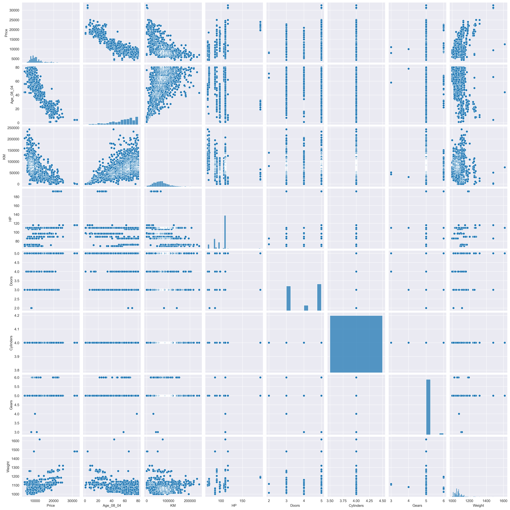

# 🚗 Toyota Corolla Price Prediction using Multiple Linear Regression

## 📌 Project Overview
This project focuses on predicting the resale prices of Toyota Corolla cars using **Multiple Linear Regression (MLR)**.

**Goals:**
- **Academic:** Practice end-to-end regression modeling (EDA, feature selection, residual analysis).  
- **Professional:** Solve a real-world business problem — predicting used car prices for better decision-making in the automotive resale market.

---

## 📊 Dataset
- **Rows:** 1436 (reduced to ~1432 after outlier handling)  
- **Columns:** 10 (after dropping `Id` and `Model`, 8 features used)  

**Key Features:**
- `Age_08_04` → Age of the car in months  
- `KM` → Mileage  
- `HP` → Horsepower  
- `Doors` → Number of doors  
- `Cylinders` → Engine cylinders  
- `Gears` → Number of gears  
- `Weight` → Car weight  

**Target Variable:** `Price`

---

## 🔧 Methodology

### Data Cleaning
- Removed irrelevant columns (`Id`, `Model`).  
- Handled outliers using Cook’s Distance.  
- Final dataset size: ~1432 records.

### Exploratory Data Analysis (EDA)
- Pairplots, correlation heatmaps, scatterplots.  
- Observations:  
  - Strong negative correlation between `Age_08_04` and `Price` (-0.87)  
  - Positive correlation between `Weight` and `Price` (0.58)  

**Pairplot:**  

### Model Building
- Implemented **Multiple Linear Regression** using `statsmodels`.  
- Iteratively refined model by removing insignificant features (`Doors`).  
- Checked multicollinearity using **VIF**.

### Model Diagnostics
- **Normality of Residuals:** Q-Q plot  
  
- **Homoscedasticity:** Residual vs Fitted plot  
  
- **Influential Points:** Detected using Cook’s Distance & Influence plots (optional for display).

---

## 📈 Results

**Final Model Performance:**
- R² = 0.875  
- Adjusted R² = 0.874  

**Key Predictors:**
- `Age_08_04` → Older cars → lower price  
- `KM` → Higher mileage → lower price  
- `HP` → Higher horsepower → higher price  
- `Weight` → Heavier cars → higher price  

**Example Prediction:**  
> For a 23-month-old Corolla with KM=46986, HP=90, Cylinders=4, Gears=5, Weight=1165,  
> the model predicts a price of ≈ 16,763 units.

---

## 📂 Files in this Repository
- `model.ipynb` → Jupyter Notebook with full analysis  
- `Toyoto_Corrola.csv` → Dataset  
- `toyota_pairplot.png` → Pairplot  
- `qqplot_residuals.png` → Q-Q plot of residuals  
- `residuals_vs_fitted.png` → Residuals vs Fitted plot  
- `requirements.txt` → Python dependencies

